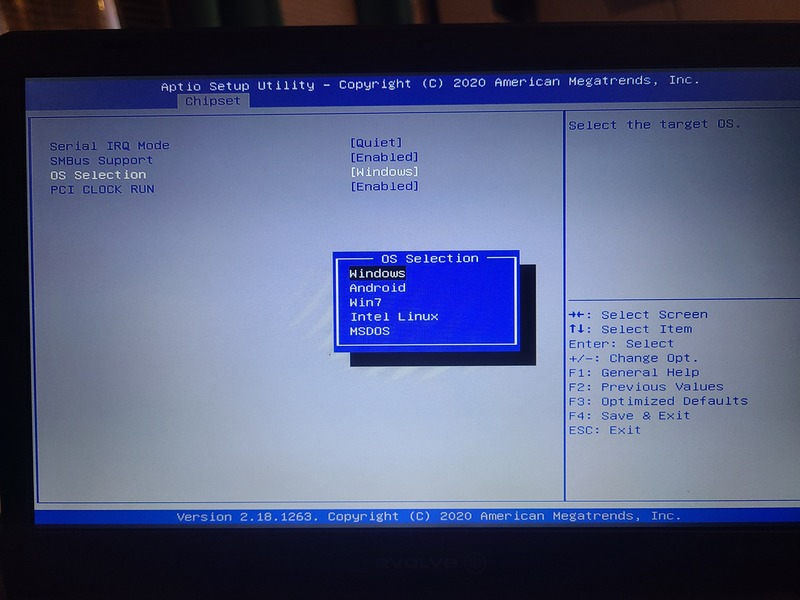

Evolve III Maestro eBook
==========

Super cheapo at Microcenter. This dir contains notes on making it run with Linux.

Notes
-----

* Hardware
    * Soldered storage, RAM. Not upgradeable.
    * Battery access by unscrewing case. No CMOS battery (main battery zero/removal means BIOS reset)
    * Cheap-feeling keyboard/touchpad. Touchpad seems quite multitouch-capable (PopOS multitouch function work well).

* Windows works, all features work. RAM usage too high (2+ GB just idle, out of 4 GB).

* Tried live boot of Ubuntu, Kubuntu, Xubuntu, Linux Mint, Pop!_OS, Fedora. Outcome same across all of them:
    * OK: basic OS, USB, HDMI, camera.
    * Wifi: Device does not exist (even in `lsusb`/`lspci`). See below.
    * Bluetooth: Device exists, but is named as if it's Wifi instead. See: https://linux-hardware.org/?id=usb:0bda-d723
    * MicroSD: Device does not exist (even in `lsusb`/`lspci`). See "BIOS Fixes" below.

* Installed Ubuntu for further experimentation.

Wifi Fix
-----

Tried USB Wifi dongle. [TP-Link Nano AC600 USB Wifi Adapter (Archer T2U Nano)](https://smile.amazon.com/dp/B07PB1X4CN).

* Does not work immediately. Needs additional driver.
* https://linux-hardware.org/?id=usb:2357-011e
* Driver: https://github.com/aircrack-ng/rtl8812au, installed using `dkms`
* Success.

BIOS/UEFI Fixes
-----

Way too many options; OEM level?

**CSM Support**

* Poor UEFI support for Linux.
* Enabling "CSM Support" made microSD card reader work.
* However, CSM breaks keyboard/screen before OS boot.
    * Once Ubuntu boots, hardware starts working. Black screen for UEFI screen and GRUB bootloader, though.


Mysterious "OS Selection" choice in the "South Bridge" configuration.




`inxi -F`
-----

```
System:    Host: jurassic Kernel: 5.13.0-30-generic x86_64 bits: 64 Console: tty pts/0 Distro: Ubuntu 21.10 (Impish Indri) 
Machine:   Type: Laptop Mobo: N/A model: N/A serial: N/A UEFI: American Megatrends v: E3-BI-11.6-Y116AR700-001-B 
           date: 04/28/2020 
Battery:   ID-1: BAT0 charge: 31.3 Wh (71.0%) condition: 44.1/N/A Wh 
CPU:       Info: Quad Core model: Intel Celeron N3450 bits: 64 type: MCP cache: L2: 1024 KiB 
           Speed: 796 MHz min/max: 800/2200 MHz Core speeds (MHz): 1: 796 2: 796 3: 796 4: 796 
Graphics:  Device-1: Intel HD Graphics 500 driver: i915 v: kernel 
           Device-2: Silicon Motion - Taiwan (formerly Feiya ) 300k Pixel Camera type: USB driver: uvcvideo 
           Display: server: X.Org 1.21.1.2 driver: loaded: i915 note: n/a (using device driver) resolution: 1366x768~60Hz 
           OpenGL: renderer: Mesa Intel HD Graphics 500 (APL 2) v: 4.6 Mesa 21.2.6 
Audio:     Device-1: Intel Celeron N3350/Pentium N4200/Atom E3900 Series Audio Cluster driver: snd_hda_intel 
           Sound Server-1: ALSA v: k5.13.0-30-generic running: yes 
           Sound Server-2: PulseAudio v: 15.0 running: yes 
           Sound Server-3: PipeWire v: 0.3.32 running: yes 
Network:   Device-1: ASIX AX88772 type: USB driver: asix 
           IF: enx0014d1da2e1e state: up speed: 100 Mbps duplex: full mac: 00:14:d1:da:2e:1e 
           IF-ID-1: wwan0 state: down mac: N/A 
Bluetooth: Device-1: Realtek 802.11n WLAN Adapter type: USB driver: btusb 
           Report: hciconfig ID: hci0 state: up address: 48:D8:90:F1:B4:7B bt-v: 2.1 
Drives:    Local Storage: total: 57.66 GiB used: 7.99 GiB (13.9%) 
           ID-1: /dev/mmcblk1 vendor: BIWIN model: N/A size: 57.66 GiB 
Partition: ID-1: / size: 55.01 GiB used: 7.99 GiB (14.5%) fs: ext4 dev: /dev/dm-0 
           ID-2: /boot/efi size: 511 MiB used: 5.2 MiB (1.0%) fs: vfat dev: /dev/mmcblk1p1 
Swap:      ID-1: swap-1 type: partition size: 980 MiB used: 0 KiB (0.0%) dev: /dev/dm-1 
Sensors:   System Temperatures: cpu: 37.0 C mobo: N/A 
           Fan Speeds (RPM): N/A 
Info:      Processes: 242 Uptime: 15m Memory: 3.66 GiB used: 1.15 GiB (31.3%) Shell: Bash inxi: 3.3.06 
```

TODO
====

* Set CSM mode = fixes microSD, but breaks UEFI/bootloader monitor
    * Maybe lower Grub wait time and let it be?
* Find onboard Wifi somehow
* Fully test onboard mobile broadband